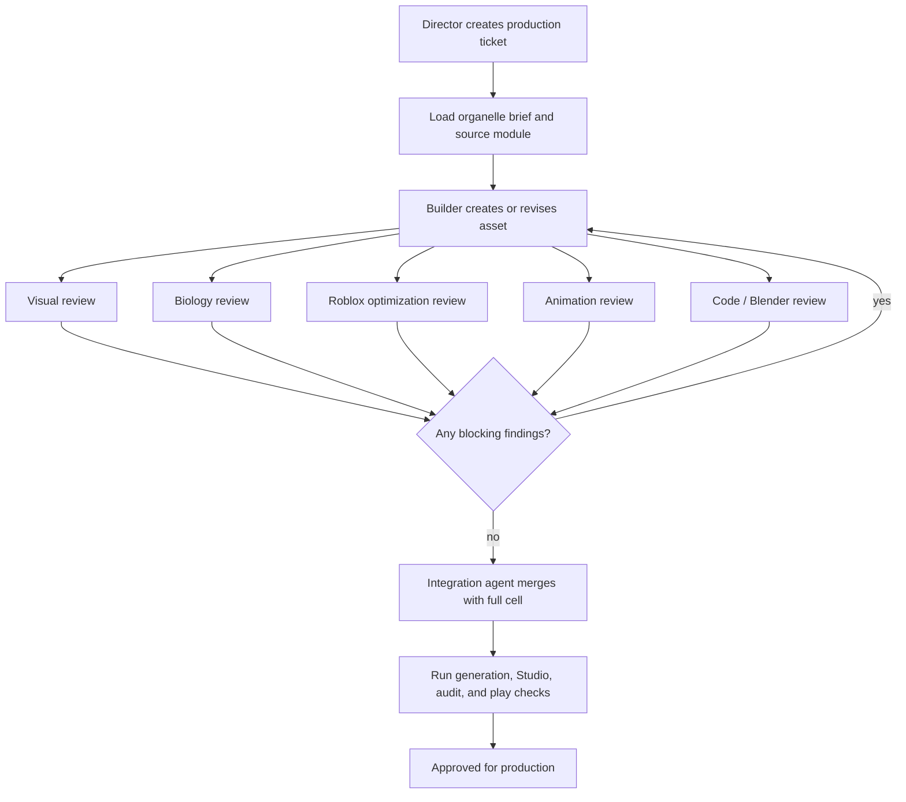

# Multi-Agent Production System

This document defines the production workflow for creating, reviewing, and
integrating organelle assets for the Roblox cell biology experience. It is
separate from the live gameplay agent runtime: these agents are a content
production studio that builds and validates organelles before they are merged
into `src/CellExperience`.

## Goal

Use a director-led multi-agent workflow instead of one giant prompt. Each
organelle should be built by a focused builder, challenged by specialist
reviewers, then integrated into the full cell by a dedicated integration pass.

The workflow should produce:

- biologically recognizable organelles
- organic Roblox-ready geometry and motion
- compact, maintainable Luau modules
- Blender/mesh assets when primitives are not enough
- student-facing hotspots and explanations
- review evidence before integration

## Current Scale-Up Policy

The nucleus Phase 07R work showed that Blender quality and Roblox usability are
separate gates. Uploading packages is not enough: each organelle must also be
assembled, placed, styled, and validated in Roblox Studio and in play mode.

Scale up one production organelle at a time. Do not start a broad batch of
organelles until the current organelle has passed the full Blender-to-Roblox
loop:

1. Organic Blender build with review renders.
2. Export groups that match biological subsystems.
3. Roblox package asset IDs recorded in a manifest.
4. Studio assembler creates hidden raw packages and a visible scoped model.
5. Group transforms, scale, pivots, materials, transparency, and collision are
   deterministic and inspectable.
6. Edit-mode validation and play-mode screenshot evidence are recorded.

For the next organelles, use the nucleus process as the template, but keep the
work scoped. A Director may assign part-level builders inside one organelle
when quality requires it, instead of one builder trying to complete the entire
organelle alone.

## Studio Layout

```text
Director / Orchestrator
+-- Organelle Builder Agents
|   +-- Nucleus Builder
|   +-- Mitochondrion Builder
|   +-- Golgi Builder
|   +-- Rough ER Builder
|   +-- Smooth ER Builder
|   +-- Ribosome Builder
|   +-- Lysosome Builder
|   +-- Membrane Builder
|   +-- Cytoskeleton / Transport Builder
+-- Specialist Review Agents
|   +-- Visual / Organic Quality Reviewer
|   +-- Biology Accuracy Reviewer
|   +-- Roblox Optimization Reviewer
|   +-- Animation Function Reviewer
|   +-- Code / Blender Script Reviewer
+-- Integration Agent
    +-- Makes all organelles work together as one cohesive cell
```

## Director / Orchestrator

The Director owns the product target and the sequence of work. It should not
write every organelle itself. Its job is to break the cell into bounded briefs,
assign the right builder, collect review feedback, decide when revisions are
required, and approve the final integration pass.

Responsibilities:

- choose the next organelle or system to build
- read the matching brief in `organelle_projects`
- define target scale, style, motion, hotspots, and performance budget
- assign builder and reviewer roles
- require structured outputs from each role
- reject ambiguous or unreviewed assets
- keep the cell visually cohesive across modules

Director output should be a production ticket:

```json
{
  "ticket_id": "organelle:mitochondrion:v1",
  "source_brief": "organelle_projects/09_mitochondria/MITOCHONDRIA_PROJECT_BRIEF.md",
  "target_module": "src/CellExperience/OrganelleModels/Mitochondria.lua",
  "review_targets": ["visual_quality", "biology_accuracy", "roblox_optimization", "animation_function", "code_quality"],
  "acceptance": {
    "visual": "Recognizable double-membrane mitochondria with organic variation.",
    "biology": "ATP production, oxygen/glucose dependency, and stress cues are represented conceptually.",
    "performance": "Works in the full scene without excessive part count or expensive per-frame work.",
    "integration": "Connects to hotspots, motion, and generated specs without breaking existing modules."
  }
}
```

## Builder Agents

Builder agents produce concrete assets for one organelle or system. They should
operate from the existing project brief, not from memory alone.

Each builder must return:

- edited Luau module paths
- generated spec paths, if any
- Blender script or mesh asset paths, if any
- hotspot copy and placement notes
- expected object hierarchy
- performance assumptions
- self-check notes against the brief

Builder roles:

| Agent | Primary Output | Key Constraints |
| --- | --- | --- |
| Nucleus Builder | Nucleus shell, pores, nucleolus, chromatin, DNA activity | Must show double membrane, pores, genome management, and scale dominance |
| Mitochondrion Builder | Mitochondria models, cristae cues, ATP/stress visual states | Must show inner folds and energy-production role |
| Golgi Builder | Stacked cisternae, budding vesicles, cargo routing | Must read as sorting/packaging rather than generic tubes |
| Rough ER Builder | Ribosome-studded folded membranes near nucleus | Must connect visually to protein synthesis and Golgi handoff |
| Smooth ER Builder | Ribosome-free tubular network | Must distinguish lipid/calcium role from rough ER |
| Ribosome Builder | Free and ER-bound ribosome populations | Must support translation cues without clutter |
| Lysosome Builder | Acidic recycling vesicles, waste intake cues | Must show degradation/recycling, not random bubbles |
| Membrane Builder | Phospholipid boundary, channels, receptors | Must preserve playable interior and clear entry/exit cues |
| Cytoskeleton Builder | Microtubules, actin-like support, cargo tracks | Must support transport readability and not obscure organelles |

## Specialist Review Agents

Review agents are adversarial in a narrow domain. They do not rewrite the whole
asset unless assigned a revision ticket. Their default output is findings with
evidence, severity, and required fix.

### Visual / Organic Quality Reviewer

Checks whether the organelle reads as an organic biological structure rather
than a simple collection of primitive parts.

Review questions:

- Is the silhouette recognizable from multiple camera distances?
- Are repeated elements varied enough to feel biological?
- Are colors informative without becoming a single-hue scene?
- Does the organelle remain readable inside the full cell?
- Are labels and hotspots placed without blocking the model?

### Biology Accuracy Reviewer

Checks simplified educational accuracy.

Review questions:

- Does the model communicate the organelle's core function?
- Are inputs, outputs, and relationships represented correctly?
- Are impossible processes implied by the visuals or animation?
- Is student-facing text concise and correct?
- Does the organelle connect to the backend simulation concepts where relevant?

### Roblox Optimization Reviewer

Checks whether the asset is viable in a Roblox place.

Review questions:

- Is part count reasonable for repeated objects?
- Are expensive loops avoided or centralized?
- Are MeshParts used where primitives would be too dense?
- Are generated specs deterministic and not hand-expanded inside modules?
- Does the model anchor, group, and name objects cleanly for validation?
- Does the Roblox import path use group/package assets correctly instead of
  assuming package uploads return child `MeshId`s?
- Are raw imported packages hidden under `Workspace.MeshLibrary` while the
  visible assembly lives under a scoped model such as `Workspace.Nucleus_Model`?
- Are material and transparency choices editable in Studio and readable in play
  mode?

### Animation Function Reviewer

Checks whether motion supports learning and runs predictably.

Review questions:

- Does animation show function rather than decorative noise?
- Are tweens, constraints, and per-frame updates scoped?
- Does motion avoid nausea, clipping, and object drift?
- Can visual states be driven by backend deltas or local gameplay state?
- Are idle, active, stressed, and inspected states distinguishable?

### Code / Blender Script Reviewer

Checks maintainability and reproducibility.

Review questions:

- Is the Luau module consistent with `Organelle.build(parent, utils, spec)`?
- Are helper functions local and scoped?
- Are generated data files used instead of pasted geometry blobs?
- Are Blender scripts deterministic and rerunnable?
- Are filenames, model names, and exported manifests stable?

## Integration Agent

The Integration Agent merges reviewed organelles into one cohesive cell. It owns
cross-organelle consistency, not individual biology.

Responsibilities:

- align scale, color language, and material choices across organelles
- connect organelles to `OrganelleRegistry`, `Hotspots`, and motion systems
- avoid collisions with the explorer path and important camera routes
- ensure generated specs load through the existing source-driven pipeline
- run validation commands and summarize failures
- create an integration report with remaining risks
- assemble Roblox package groups into a stable scoped model
- keep raw package imports preserved but hidden
- verify both edit-time and play-time scene state

Integration must check:

```text
python3 tools/generate_cell_specs.py
python3 tools/deploy_to_studio.py
python3 tools/validate_studio_scene.py
python3 tools/audit_studio_scene.py
python3 tools/validate_play_server.py
```

If Roblox Studio or MCP is unavailable, the integration report must say exactly
which checks were skipped and why.

For package-based organelles, integration must also check:

```text
python3 tools/validate_<organelle>_roblox_export_manifest.py
python3 tools/assemble_<organelle>_packages_in_studio.py
python3 tools/validate_<organelle>_studio_assembly.py
```

If the official MCP bridge is unavailable, probe the legacy bridge and then use
Computer Use as the manual fallback. The final acceptance target is not a file
on disk; it is a visible, correctly assembled, editable model in Roblox Studio
that still reads correctly in play mode.

## Workflow



## Review Contract

Every reviewer should return structured findings:

```json
{
  "reviewer": "biology_accuracy",
  "decision": "changes_required",
  "findings": [
    {
      "severity": "blocking",
      "component": "rough_er.ribosome_distribution",
      "issue": "Ribosomes appear on smooth ER tubes.",
      "required_fix": "Keep ribosome particles only on rough ER membranes and near translation hotspots.",
      "evidence": "Rendered review A and OrganelleModels/RoughER.lua"
    }
  ],
  "passed_checks": ["protein folding shown", "Golgi handoff represented"],
  "open_questions": []
}
```

Allowed decisions:

- `approved`
- `approved_with_notes`
- `changes_required`
- `blocked`

Blocking findings must be fixed before integration.

## Roblox Package Gate

For any organelle intended for Roblox package import, the review packet must
include a Roblox package gate report:

```json
{
  "decision": "changes_required",
  "package_assets_recorded": false,
  "studio_assembly_present": false,
  "raw_packages_hidden": false,
  "top_level_duplicates": [],
  "visible_model": "Workspace.<Organelle>_Model",
  "group_count_expected": 0,
  "group_count_found": 0,
  "bounds_by_group": {},
  "material_buckets": {},
  "transparency_buckets": {},
  "edit_mode_screenshot": null,
  "play_mode_screenshot": null,
  "required_fixes": []
}
```

This gate cannot pass when only Blender looks correct. It also cannot pass when
only Roblox edit mode looks correct; play mode must be checked because scale,
camera readability, hidden raw imports, and transparency issues often show up
there first.

## Artifact Contract

Each production pass should leave artifacts in predictable locations:

```text
organelle_projects/<id>_<name>/
+-- *_PROJECT_BRIEF.md
+-- assets/
|   +-- export_manifest.json
|   +-- component_map.md
+-- reviews/
|   +-- visual_quality.json
|   +-- biology_accuracy.json
|   +-- roblox_optimization.json
|   +-- animation_function.json
|   +-- code_quality.json
+-- integration_report.md
```

Production code should land in:

```text
src/CellExperience/OrganelleModels/
src/CellExperience/Data/Generated/
src/CellExperience/Education/
src/CellExperience/Gameplay/
tools/
```

## Prompt Template

Use this shape when assigning an agent:

```text
Role: <Builder or Reviewer role>
Target: <organelle/system>
Source brief: <path>
Current implementation: <path>
Output format: <builder artifact list or review JSON>

Constraints:
- Preserve existing Roblox source-driven pipeline.
- Keep biology conceptual and student-safe.
- Do not generate wet-lab protocol content.
- Use deterministic generated specs when geometry is dense.
- Do not directly mutate unrelated organelle modules.

Acceptance:
- <ticket-specific pass criteria>
```

## Production Rule

No organelle should be treated as done because a single prompt produced a good
first draft. It is done when the builder output survives specialist review, the
integration pass keeps the full cell coherent, and validation evidence is
recorded.

For the next organelle, start with a production ticket that names the exact
biological subsystem export groups, the expected Roblox package names, the
Studio model path, and the validation scripts before any geometry is built.
