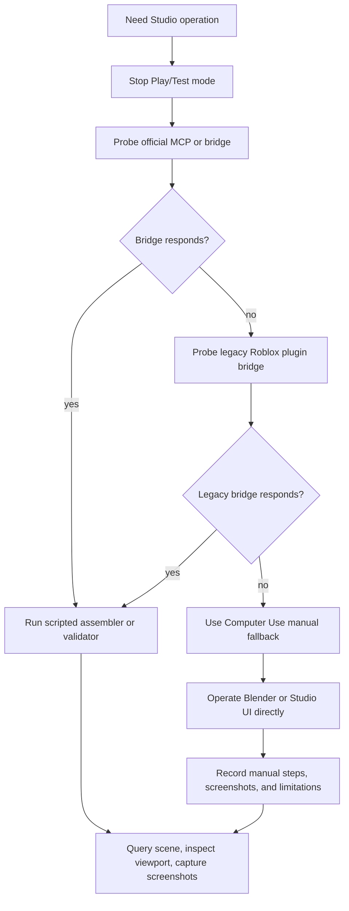

# Organelle Production Process Flow

This is the review map for scaling from the nucleus to the next production
organelles. Use it to check whether the process is actually in place before
starting a new organelle or approving a phase.

## Main Flow

```mermaid
flowchart TD
    A["0. Director ticket<br/>organelle scope, biological systems, target Roblox model path"] --> B["1. Brief and manifest gate<br/>AGENTS, brief, component manifest, local rules"]
    B --> C["2. Reference baseline gate<br/>images, design principles, biology constraints"]
    C --> D["3. Builder phase<br/>part-level builders or one scoped organelle builder"]
    D --> E["4. Blender evidence<br/>script, .blend, review renders, builder report"]
    E --> F["5. Specialist reviews<br/>visual, biology, animation, Roblox export, code"]
    F --> G{"Any blocking review finding?"}
    G -- "yes" --> D
    G -- "no" --> H["6. Organelle integration scene<br/>approved parts assembled into one Blender source"]
    H --> I["7. Export groups<br/>logical biological subsystem packages"]
    I --> J["8. Export validation<br/>FBX/GLB files, counts, excluded review-only objects"]
    J --> K{"Export manifest passes?"}
    K -- "no" --> I
    K -- "yes" --> L["9. Roblox package upload<br/>one package/model asset per export group"]
    L --> M["10. Asset manifest update<br/>package asset IDs, operation IDs, status, notes"]
    M --> N{"All required package IDs recorded?"}
    N -- "no" --> L
    N -- "yes" --> O["11. Studio assembly<br/>raw packages hidden, visible scoped model rebuilt"]
    O --> P["12. Edit-mode validation<br/>groups, bounds, materials, transparency, duplicates"]
    P --> Q{"Edit mode passes?"}
    Q -- "no" --> O
    Q -- "yes" --> R["13. Play-mode validation<br/>player camera, scale, readability, collisions"]
    R --> S{"Play mode passes?"}
    S -- "no" --> O
    S -- "yes" --> T["14. QA report and screenshots<br/>Director approval or revision ticket"]
    T --> U{"Current organelle production-ready?"}
    U -- "no" --> D
    U -- "yes" --> V["15. Start next organelle ticket<br/>reuse process, do not copy offsets blindly"]
```



## Validation Gates

| Gate | Must Prove | Evidence |
| --- | --- | --- |
| Brief and manifest | The work scope is bounded and biologically meaningful. | `AGENTS.md`, local `AGENTS.md`, `brief.md`, `component_manifest.json` |
| Reference baseline | Reviewers know what visual target is being judged. | `REFERENCE_IMAGE_DESIGN_PRINCIPLES.md`, `reference_images/reference_manifest.json`, reference paths in review JSON |
| Blender build | The organelle is organic, layered, rounded, textured, and not placeholder geometry. | Updated Blender script, `.blend`, review renders, builder report |
| Specialist reviews | Quality is challenged before export. | Visual, biology, animation, Roblox export, and code review JSON |
| Revision gate | Blocking failures are fixed before moving forward. | Pass/fail checklist and updated reports |
| Export groups | Roblox receives logical biological subsystem packages, not random objects. | Exported `.fbx` files, export manifest, object/material/triangle counts |
| Package upload | Roblox package/model asset IDs are recorded as source of truth. | `package_asset_id`, upload operation ID, status per group |
| Studio assembly | Raw packages are preserved but hidden; only reviewed clones are visible. | Rerunnable assembly script, `Workspace.MeshLibrary`, `Workspace.<Organelle>_Model` |
| Edit-mode validation | The editable Studio scene is correct outside Play/Test. | Group count, bounds, material buckets, transparency buckets, duplicate/raw visibility check |
| Play-mode validation | The player sees the correct scale, placement, transparency, and collision behavior. | Play-mode screenshot, validator output, QA report |
| Director approval | The organelle can become the template for the next organelle. | Final QA report with blockers, risks, next recommended phase |

## Roblox Assembly Rule

Roblox package uploads return package/model asset IDs. They are not reliable
per-child `MeshId` outputs. Runtime and Studio assembly should target package
groups and manifest IDs, not fragile imported child names.

Expected Studio structure:

```text
Workspace
+-- MeshLibrary
|   +-- <Organelle>_RawPackages
|       +-- EXPORT_LOD0_<Subsystem>         hidden raw package
|       +-- EXPORT_COLLISION_<Proxy>        hidden raw package
|       +-- EXPORT_ANCHORS_<Sockets>        hidden raw package
+-- <Organelle>_Model
    +-- <SubsystemDisplayName>              visible clone
    +-- CollisionProxy                      invisible or debug-only
    +-- AnchorSockets                       invisible or debug-only
```

The assembler must be rerunnable. It should hide raw packages, quarantine stale
top-level duplicates, rebuild the visible scoped model, apply deterministic
scale and placement, and set Roblox-editable material fallbacks.

## MCP and Manual Fallback



Do not mark a Roblox phase as passed just because an upload succeeded. It only
passes when the assembled model is visible, correctly placed, editable in Studio,
and readable in play mode.

## Reviewer Checklist

Before approving the process for the next organelle, verify:

- The current organelle has a Director ticket and bounded export groups.
- Every visible biological component has reference-baseline review evidence.
- Biology review lists misconceptions avoided.
- Export validation excludes cameras, lights, reference planes, review boards,
  and hidden markers.
- Package asset IDs are in the manifest for every required group.
- Raw imported packages have zero visible BaseParts.
- There are no visible top-level `EXPORT_*` duplicates in `Workspace`.
- `Workspace.<Organelle>_Model` contains every expected group.
- Collision proxy and anchor sockets exist but do not block inspection.
- Main visible components are mostly opaque and editable in Studio.
- Transparent components are limited to biological reasons such as lumen or
  nucleoplasm.
- Edit-mode and play-mode validation both pass.
- Screenshots and QA JSON are saved with the phase report.
- Remaining risks are explicit enough to become the next ticket.

## Failure Policy

Fail the phase and return to the most recent builder or assembler step when:

- there are no reference images and the visual review does not disclose that
  limitation
- geometry still reads as toy-like, smooth, or primitive
- biology accuracy fails on a major misconception
- Roblox upload succeeded but package IDs were not recorded
- Studio assembly only works in Play/Test mode
- raw packages and visible clones are both visible
- transparent imports dominate the model or cannot be recolored in Studio
- group scale, pivot, or placement is manually guessed but not recorded in the
  assembler or manifest
