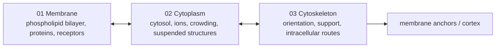
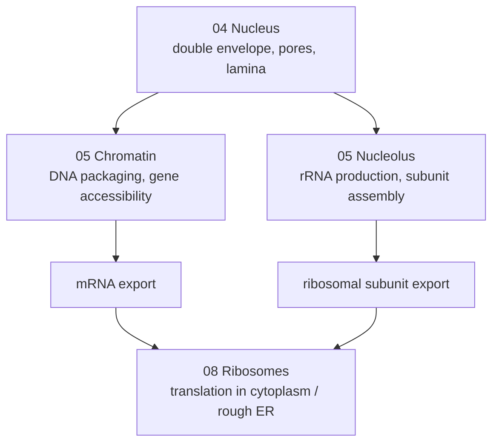
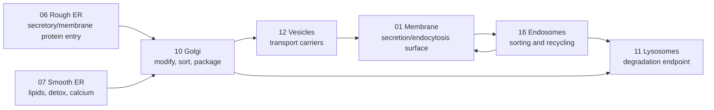
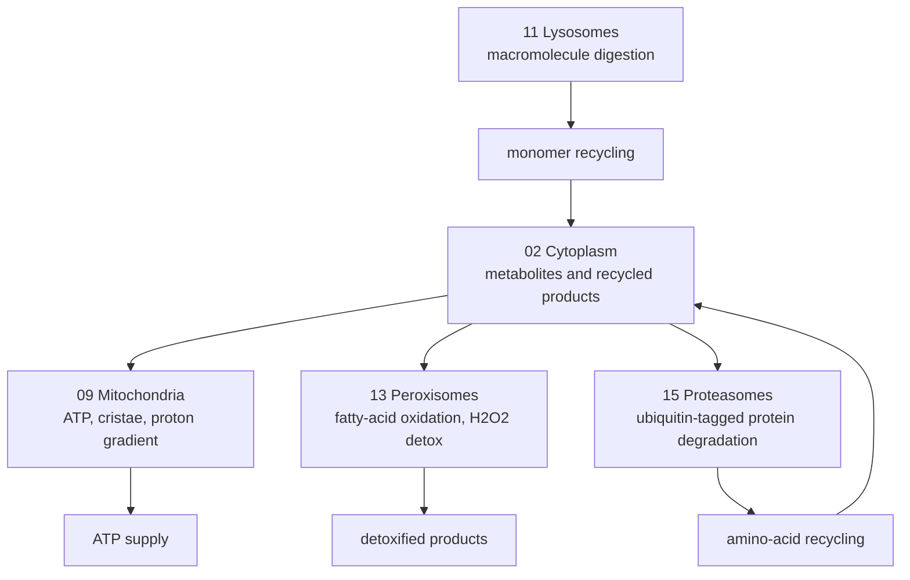
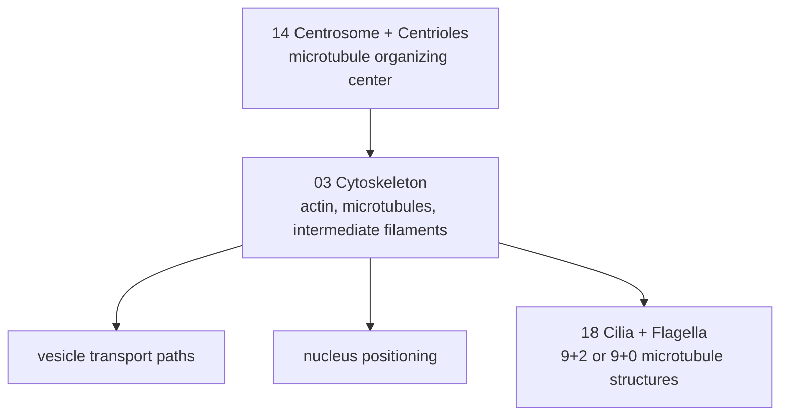
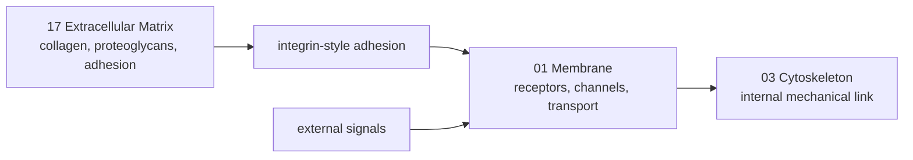

# Organelle Subcharts

These charts split the cell structures into smaller review groups before Roblox
implementation. Each node maps to one project brief in `organelle_projects/`.

## Whole-Cell Review Map

```mermaid
flowchart TD
    cell["Human / Animal Eukaryotic Cell"]

    cell --> boundary["Boundary + Interior"]
    cell --> genome["Genome + Information Flow"]
    cell --> secretion["Endomembrane + Trafficking"]
    cell --> metabolism["Energy + Recycling"]
    cell --> structure["Structure + Motility"]
    cell --> surface["Cell Surface + Environment"]

    boundary --> membrane["01 Membrane"]
    boundary --> cytoplasm["02 Cytoplasm"]

    genome --> nucleus["04 Nucleus"]
    genome --> nucleolus["05 Nucleolus + Chromatin"]
    genome --> ribosomes["08 Ribosomes"]

    secretion --> roughER["06 Rough ER"]
    secretion --> smoothER["07 Smooth ER"]
    secretion --> golgi["10 Golgi Apparatus"]
    secretion --> vesicles["12 Vesicles + Vacuoles"]
    secretion --> endosomes["16 Endosomes"]

    metabolism --> mitochondria["09 Mitochondria"]
    metabolism --> lysosomes["11 Lysosomes"]
    metabolism --> peroxisomes["13 Peroxisomes"]
    metabolism --> proteasomes["15 Proteasomes"]

    structure --> cytoskeleton["03 Cytoskeleton"]
    structure --> centrosome["14 Centrosome + Centrioles"]
    structure --> cilia["18 Cilia + Flagella"]

    surface --> ecm["17 Extracellular Matrix"]
    surface --> membrane
```

## Boundary + Interior

Roblox review focus:

- The membrane defines the playable boundary and scale.
- Cytoplasm should make the interior readable without blocking movement.
- Cytoskeleton should create navigation routes and spatial orientation.

## Genome + Information Flow

Roblox review focus:

- Keep DNA inside the nucleus.
- Show nuclear pores as selective gates, not open holes.
- Keep the nucleolus non-membrane-bound.
- Use the ribosome model as the handoff point from nuclear information to
  cytoplasmic protein synthesis.

## Endomembrane + Trafficking

Roblox review focus:

- Protein path: rough ER -> Golgi -> vesicles -> membrane or lysosome.
- Lipid/detox path: smooth ER should look related to ER but visually distinct.
- Endosomes deserve a separate sorting chart even though they overlap with
  vesicles.
- Vesicle animation should use paths and pooling rather than physics clutter.

## Energy + Recycling

Roblox review focus:

- Mitochondria should show inner membrane/cristae, not just a bean shape.
- Peroxisomes should be visually distinct from lysosomes.
- Lysosomes digest vesicle/autophagy cargo; proteasomes degrade tagged proteins
  in the cytosol/nucleus.

## Structure + Motility

Roblox review focus:

- Cytoskeleton should support gameplay navigation and biological transport.
- Centrosome/centrioles can serve as a visual hub for microtubules.
- Cilia/flagella are optional depending on the cell type, but useful for
  showing microtubule-based movement.

## Cell Surface + Environment

Roblox review focus:

- The extracellular matrix belongs outside the cell and should not be confused
  with cytoplasm.
- Membrane receptors should connect outside signals to internal responses.
- Surface design matters if later builds include tissues or multiple cells.

