# Project Structure

This repository is organized around a Roblox learning experience with a
server-side simulation backend and research/design documentation for each cell
structure.

```text
.
├── backend/                    # FastAPI simulation authority and tests
├── docs/                       # Architecture, Roblox MCP, and development plans
├── organelle_projects/         # Per-organelle research/design workspaces
├── roblox_bridge/              # Luau scripts for backend communication
├── src/CellExperience/         # Source-driven Roblox place builder
├── tools/                      # Generation, deployment, and validation scripts
├── AnimalCellVillageBuilder.server.lua
├── README.md
└── CONTRIBUTING.md
```

## Repository Diagram

```mermaid
flowchart TD
    repo["AI Learning Experience Repo"]

    repo --> rootDocs["Root Docs + Metadata"]
    rootDocs --> readme["README.md"]
    rootDocs --> contributing["CONTRIBUTING.md"]
    rootDocs --> gitignore[".gitignore / .gitattributes"]
    rootDocs --> ci[".github/workflows/backend-tests.yml"]

    repo --> backend["backend/"]
    backend --> api["app/api<br/>sessions, cells, agents, admin"]
    backend --> agents["app/agents<br/>agent runtime, providers, prompts"]
    backend --> sim["app/sim<br/>biology rules, engine, reducer"]
    backend --> schemas["app/schemas<br/>API and state contracts"]
    backend --> storage["app/storage<br/>memory + SQLite stores"]
    backend --> tests["tests/<br/>backend validation"]

    repo --> roblox["roblox_bridge/"]
    roblox --> bridge["CellBackendBridge.server.lua"]
    roblox --> remotes["CellRemotes.lua"]
    roblox --> client["CellClientExample.client.lua"]

    repo --> src["src/CellExperience/"]
    src --> builders["Builders + BuildUtils"]
    src --> gameplay["Gameplay controllers"]
    src --> organelleModels["OrganelleModels"]
    src --> generated["Data/Generated geometry specs"]
    src --> education["Education hotspots"]

    repo --> docs["docs/"]
    docs --> orchestration["AGENTIC_ROBLOX_ORCHESTRATION.md"]
    docs --> mcp["ROBLOX_MCP.md"]
    docs --> roadmap["ROADMAP.md"]
    docs --> developmentPlan["ORGANELLE_DEVELOPMENT_PLAN.md"]
    docs --> productionSystem["MULTI_AGENT_PRODUCTION_SYSTEM.md"]
    docs --> subcharts["ORGANELLE_SUBCHARTS.md"]

    repo --> organelles["organelle_projects/"]
    organelles --> overview["ORGANELLE_PROJECTS_OVERVIEW.md"]
    organelles --> index["DOCUMENT_INDEX.md"]
    organelles --> projects["01-18 organelle project folders"]
    projects --> briefs["PROJECT_BRIEF.md files"]
    projects --> workspace["assets / docs / exports / specs / src / tests"]

    repo --> tools["tools/"]
    tools --> generation["generate_cell_specs.py"]
    tools --> studio["deploy_to_studio.py<br/>roblox_mcp_smoke.py"]
    tools --> validation["audit + validate scripts"]
```



## Core Layers

- `src/CellExperience` builds the Roblox world from Luau modules and generated
  geometry specs.
- `backend` owns canonical simulation state, biology rules, organelle agents,
  and API contracts.
- `roblox_bridge` shows how Roblox server scripts communicate with the backend
  through `HttpService`.
- `organelle_projects` is the planning and research layer for organelles and
  cell structures before they become production Roblox modules.

## Organelle Project Contract

Each organelle project should eventually produce a ModuleScript-compatible Luau
builder:

```lua
function Organelle.build(parent, utils, spec)
    return model, hotspots
end
```

The returned `model` should be movable as one Roblox `Model`, and `hotspots`
should describe the student-facing learning points.
